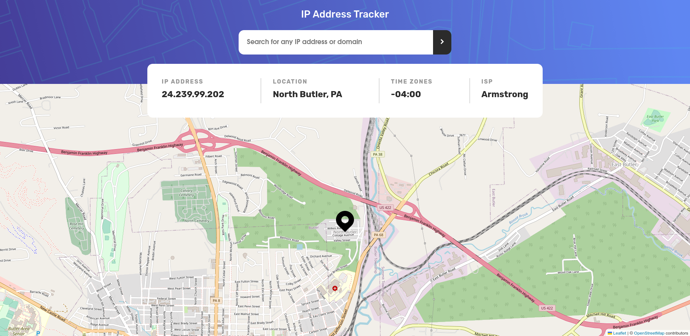

# Frontend Mentor - IP address tracker solution

This is a solution to the [IP address tracker challenge on Frontend Mentor](https://www.frontendmentor.io/challenges/ip-address-tracker-I8-0yYAH0). Frontend Mentor challenges help you improve your coding skills by building realistic projects.

## Table of contents

- [Overview](#overview)
  - [The challenge](#the-challenge)
  - [Screenshot](#screenshot)
  - [Links](#links)
  - [Built with](#built-with)
- [Author](#author)

## Overview

### The challenge

Users should be able to:

- View the optimal layout for each page depending on their device's screen size
- See hover states for all interactive elements on the page
- See their own IP address on the map on the initial page load
- Search for any IP addresses or domains and see the key information and location

### Screenshot

### Links

- Solution URL: [Add solution URL here](https://your-solution-url.com)
- Live Site URL: [Add live site URL here](https://your-live-site-url.com)

### Built with

- [React](https://reactjs.org/)
- [Styled Components](https://styled-components.com/)
- [React Spinners](https://www.npmjs.com/package/react-spinners/)
- [React Leaflet](https://react-leaflet.js.org/)
- [Prop Types](https://www.npmjs.com/package/prop-types/)
- [IPIFY](https://www.ipify.org/)
- [US-State-Codes](https://www.npmjs.com/package/us-state-codes/)
- [Netlify](https://app.netlify.com/)
- [Node API Proxy](https://github.com/Jakelanghel/api-proxy-server/)
- Mobile-first workflow
- CSS custom properties
- Flexbox

## Author

- Frontend Mentor - [@yourusername](https://www.frontendmentor.io/profile/yourusername)
